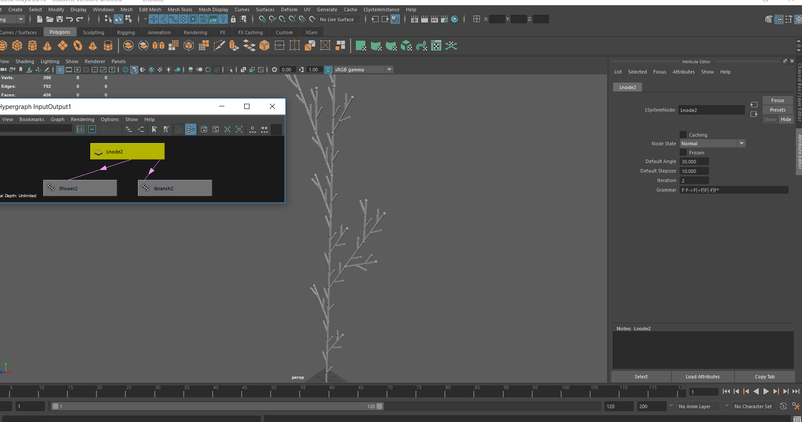
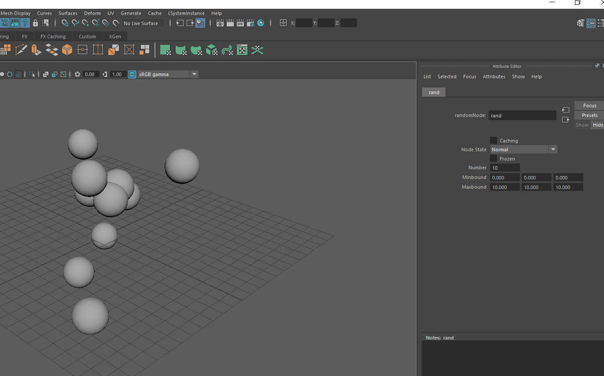

1.Please change the file path of mel script "menuinitialization.mel" before you run this program.
 Open "hw03_XiYang.py"  and  change " fileHandle = open('E:\EDocuments\cis660\hw3\HW3_basecode\menuinitialization.mel', 'r' )"

2.After change mel file path, load "hw03_XiYang.py" in maya and test with it.

  Please note that menu "LSystemNode(selected)", you need to select a cube or cylinder first and then the sphere.
  
  
Screen shots:

